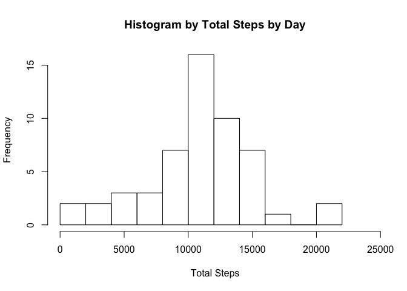
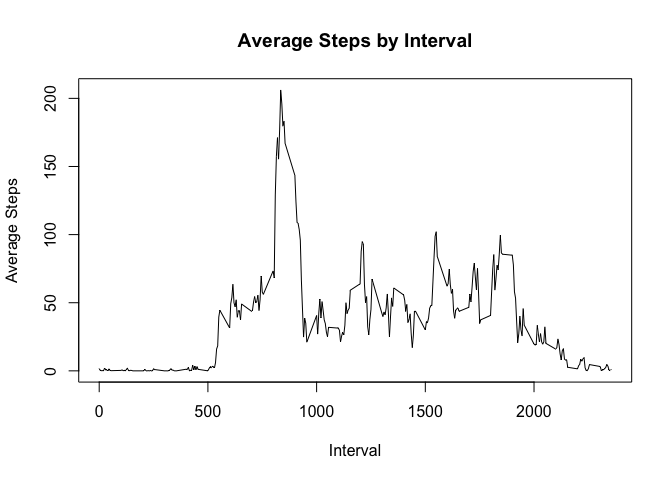
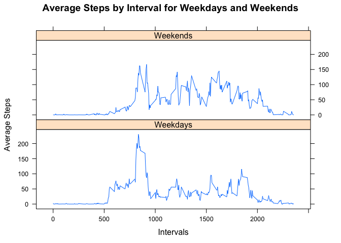

# Reproducible Research: Peer Assessment 1
Tan Yih Siang  
17 Nov 2016  


## Introduction
It is now possible to collect a large amount of data about personal movement using activity monitoring devices such as a Fitbit, Nike Fuelband, or Jawbone Up. These type of devices are part of the “quantified self” movement – a group of enthusiasts who take measurements about themselves regularly to improve their health, to find patterns in their behavior, or because they are tech geeks. But these data remain under-utilized both because the raw data are hard to obtain and there is a lack of statistical methods and software for processing and interpreting the data.

This assignment makes use of data from a personal activity monitoring device. This device collects data at 5 minute intervals through out the day. The data consists of two months of data from an anonymous individual collected during the months of October and November, 2012 and include the number of steps taken in 5 minute intervals each day.

## Data
The data for this assignment can be downloaded from the course web site:

Dataset: [Activity monitoring](https://d396qusza40orc.cloudfront.net/repdata%2Fdata%2Factivity.zip) data [52K]
The variables included in this dataset are:

steps: Number of steps taking in a 5-minute interval (missing values are coded as 𝙽𝙰)
date: The date on which the measurement was taken in YYYY-MM-DD format
interval: Identifier for the 5-minute interval in which measurement was taken
The dataset is stored in a comma-separated-value (CSV) file and there are a total of 17,568 observations in this dataset.

## Assessment

### Loading and preprocessing the data

```r
# Unzip the read the CSV file
unzip("activity.zip", exdir="./")
activity <- read.csv("activity.csv", header = TRUE, na.strings = "NA")
activity$date <- as.Date(activity$date, "%Y-%m-%d")
summary(activity)
```

```
##      steps             date               interval     
##  Min.   :  0.00   Min.   :2012-10-01   Min.   :   0.0  
##  1st Qu.:  0.00   1st Qu.:2012-10-16   1st Qu.: 588.8  
##  Median :  0.00   Median :2012-10-31   Median :1177.5  
##  Mean   : 37.38   Mean   :2012-10-31   Mean   :1177.5  
##  3rd Qu.: 12.00   3rd Qu.:2012-11-15   3rd Qu.:1766.2  
##  Max.   :806.00   Max.   :2012-11-30   Max.   :2355.0  
##  NA's   :2304
```


### What is mean total number of steps taken per day?

```r
# Aggregate and sum the total number of steps per day
stepsByDate <- aggregate(activity$steps ~ activity$date, activity, sum, na.rm = TRUE)
hist(stepsByDate$`activity$steps`, xlab="Total Steps", ylab="Frequency", main="Histogram by Total Steps by Day", breaks=10, xlim=c(0,max(stepsByDate$`activity$steps`)+3000))
```

<!-- -->

```r
meanSteps <- mean(stepsByDate$`activity$steps`)
medianSteps <- median(stepsByDate$`activity$steps`)
```

The mean total number of steps taken per day is 10766.1886792
The median total number of steps taken per day is 10765

### What is the average daily activity pattern?

```r
#stepsByInterval <- aggregate(activity$steps, by=list(interval=activity$interval), FUN=mean, na.rm=TRUE)
stepsByInterval <- aggregate(activity$steps ~ activity$interval, activity, FUN=mean, na.rm=TRUE)
names(stepsByInterval)[1] <- "interval"
names(stepsByInterval)[2] <- "averageSteps"
plot(stepsByInterval$interval, stepsByInterval$averageSteps, type="l", xlab="Interval", ylab="Average Steps", main="Average Steps by Interval")
```

<!-- -->

```r
maxNumberOfStepsInterval = stepsByInterval[stepsByInterval$averageSteps==max(stepsByInterval$averageSteps),]$interval
```
The 835th 5-minute interval has the maximum average number of 206.1698113 steps across all days 

### Imputing missing values

```r
# Count the number of NA values and the percentage of these missing values
sum(is.na(activity$steps))
```

```
## [1] 2304
```

```r
(sum(is.na(activity$steps))/length(activity$steps))*100
```

```
## [1] 13.11475
```

The number of NAs in the data set for steps is 2304 which accounts for 13.11%

To remove bias from calcuating the summaries, steps with NAs will be imputed using mean of steps from the same interval across all days


```r
# Impute NA values with mean of steps for the same interval across all days
imputed <- transform(activity, steps = ifelse(is.na(activity$steps), round(stepsByInterval$averageSteps[match(activity$interval, stepsByInterval$interval)]), activity$steps))
summary(imputed)
```

```
##      steps             date               interval     
##  Min.   :  0.00   Min.   :2012-10-01   Min.   :   0.0  
##  1st Qu.:  0.00   1st Qu.:2012-10-16   1st Qu.: 588.8  
##  Median :  0.00   Median :2012-10-31   Median :1177.5  
##  Mean   : 37.38   Mean   :2012-10-31   Mean   :1177.5  
##  3rd Qu.: 27.00   3rd Qu.:2012-11-15   3rd Qu.:1766.2  
##  Max.   :806.00   Max.   :2012-11-30   Max.   :2355.0
```

### Are there differences in activity patterns between weekdays and weekends?

To determine weekdays or weekends, a new column to indicate Weekday or Weekend is added to the data set. The imputed data set is used for this assessment


```r
imputed <- mutate(imputed, dayofweek = factor(ifelse(weekdays(imputed$date)=="Saturday" | weekdays(imputed$date)=="Sunday", "Weekends", "Weekdays")))

averageStepsbyDayofWeek = aggregate(imputed$steps ~ imputed$interval + imputed$dayofweek, imputed, mean)

xyplot(averageStepsbyDayofWeek$`imputed$steps` ~ averageStepsbyDayofWeek$`imputed$interval`|averageStepsbyDayofWeek$`imputed$dayofweek`, type = "l", layout = c(1,2), main = "Average Steps by Interval for Weekdays and Weekends", xlab = "Intervals", ylab = "Average Steps")
```

<!-- -->
